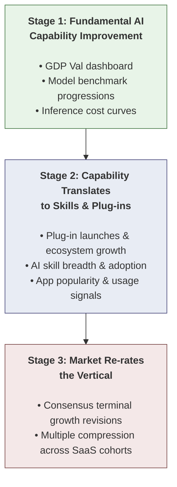

# SaaS AI Displacement — Vibe Coded Demos

---

# For Humans

## Investment Thesis

AI model improvements don't just threaten SaaS revenue next quarter — they threaten the **terminal value** that underpins most of these stocks' DCFs. The causal chain runs through three stages:



> Data Science tracks Stage 1 and Stage 2 signals via Mosaic KPIs. Those feeds inform our displacement scoring for each name.

**Stage 1 — Fundamental AI Capability Improvement**

- Each generation of frontier models closes capability gaps that protected incumbent software
- [GDP Val Dashboard (Mosaic)](https://mosaic.coatue.com/exploreDatasets/global?dashboardId=52186&folderId=132067&fundId=3&widgetIds=79720,79721,79722,79723,79724,79725,79726,79727,79728,79729,79730,79731,79732,79733,79734,79735,79736,79737,79738,79739,79740,79741,79742,79743,79744,79745,79746,79747,79748,79749,79750,79751,79752,79753,79754,79755,79756,79757,79758,79759,79760,79761,79762,79763,79764,79777,79809)

**Stage 2 — Capability Translates to Skills & Plug-ins**

- Advances translate into plug-ins, AI skills, and agents that directly replicate what SaaS companies sell
- Demo apps in this repo are working prototypes of "AI-native" replacements for specific public companies' core products
- [Plug-in & Skill Launches (Claude)](https://claude.com/plugins)
- [Product Capabilities Dashboard (Mosaic)](https://mosaic.coatue.com/exploreDatasets/global?dashboardId=52173&folderId=132067&fundId=3&widgetIds=79697,79699)

**Stage 3 — Market Re-rates the Vertical**

- Outer-year revenue underpinning 80%+ of DCF is at risk — market re-rates on terminal value breakdown, not near-term earnings misses
- Multiple compresses as the vertical gets repriced

## The Terminal Value Problem

So much of SaaS valuation is backloaded. Near-term earnings are noise. The real question for each name is: **how susceptible is this business to AI model risk in years 5-10?**

That's what this project stress-tests. Each demo app targets a specific company and asks: if an AI agent can do 80% of what this product does today, what happens to seat growth, pricing power, and retention in the outer years?

---

# For Machines

## Project Structure

```
flong_software/
├── saas-ai-displacement/       # Research: analysis framework, CSV data, category notes
├── vibe_apps_code/             # Demo apps (one per ticker)
│   ├── CRM/app/                # AI Deal Room (Salesforce replacement)
│   ├── INTU/app/               # AI Bookkeeper (QuickBooks/TurboTax replacement)
│   ├── MNDY/app/               # AI Project Manager (monday.com replacement)
│   ├── ADBE/                   # (planned)
│   ├── CSGP/                   # (planned)
│   ├── GTLB/                   # (planned)
│   ├── SHOP/                   # (planned)
│   ├── SNOW/                   # (planned)
│   └── SPGI/                   # (planned)
```

## Tech Stack (all apps)

- **Framework:** Next.js 16 + React 19
- **Styling:** Tailwind CSS v4
- **Charts:** Recharts
- **Icons:** Lucide React
- **Language:** TypeScript

All "AI" logic is client-side only (keyword matching, rule-based scoring, template interpolation). No LLM API calls.

## Running the Apps

Each app lives in `vibe_apps_code/<TICKER>/app/`. First-time setup requires `npm install` in each app directory.

### Quick Start (all 3 apps)

```bash
# Install dependencies (first time only)
cd vibe_apps_code/CRM/app  && npm install
cd vibe_apps_code/INTU/app && npm install
cd vibe_apps_code/MNDY/app && npm install

# Run all 3 on different ports
cd vibe_apps_code/CRM/app  && npm run dev -- -p 3000 &
cd vibe_apps_code/INTU/app && npm run dev -- -p 3001 &
cd vibe_apps_code/MNDY/app && npm run dev -- -p 3002 &
```

### App URLs


| App                | Ticker | Port | URL                        | Description                                                                                                                               |
| ------------------ | ------ | ---- | -------------------------- | ----------------------------------------------------------------------------------------------------------------------------------------- |
| AI Deal Room       | CRM    | 3000 | http://localhost:3000/crm  | Pipeline dashboard, deal scoring, email composer                                                                                          |
| AI Bookkeeper      | INTU   | 3001 | http://localhost:3001/intu | Transaction categorizer, financial statements, compliance, forecasting |
| AI Project Manager | MNDY   | 3002 | http://localhost:3002/mndy | Kanban board, Gantt chart, workload view, status reports                                                                                  |

### Stop All Servers

```bash
lsof -ti:3000,3001,3002 | xargs kill -9
```

## App Details

### CRM — AI Deal Room

**Thesis:** CRM is a pipeline tracker + email drafter. AI scores deals, surfaces risks, and writes follow-ups — making the rep a supervisor, not a data entry clerk.

- Pipeline Dashboard with funnel visualization and metric cards
- Deal Detail Panel with AI-scored win probability and risk factors
- Interaction Timeline with sentiment badges
- Email Composer with template interpolation

### INTU — AI Bookkeeper

**Thesis:** Bookkeeping is data entry + categorization + report formatting — all trivially automatable. An AI agent ingests bank transactions, auto-categorizes them, and generates financial statements in seconds.

- Transaction Categorizer with confidence-scored COA mapping (click to override)
- Financial Statement Generator (Income Statement, Balance Sheet, Cash Flow)
- Compliance Dashboard with severity-flagged issues
- 90-Day Cash Flow Forecast with confidence bands

### MNDY — AI Project Manager

**Thesis:** Describe your project in one sentence and get a full task breakdown, Gantt chart, and team assignments. monday.com's UI is low moat — seat growth stalls as AI agents commoditize the interface layer.

- Kanban Board with drag-and-drop and AI project generation
- Interactive SVG Gantt Chart with dependency arrows and critical path
- Team Workload View with allocation thresholds
- Status Report Generator with copy/download

## Adding New Apps

Each app follows a consistent pattern. See any existing `PLAN.md` for the spec:

1. `<TICKER>/PLAN.md` — Feature spec and data schema
2. `<TICKER>/app/src/data/` — Mock JSON data
3. `<TICKER>/app/src/lib/` — Types, utilities, "AI" logic
4. `<TICKER>/app/src/components/` — React components
5. `<TICKER>/app/src/app/<route>/page.tsx` — Next.js page

Config files (package.json, tsconfig, postcss, eslint, gitignore) are identical across all apps.
